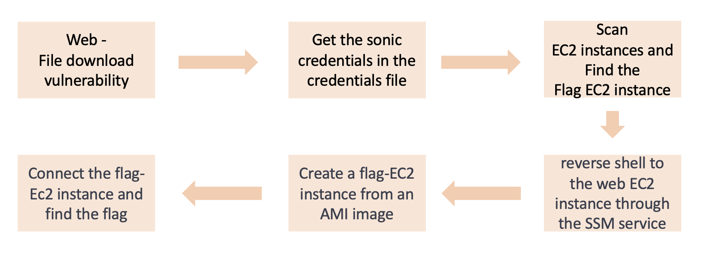

# Scenario: FD-SSM (File Download - Systems Manager)

**Size:** Medium

**Difficulty:** Moderate

**Command:** 
- creation: `$ cd ./terraform; terraform init; terraform apply`
- destruction: `$ cd ./terraform; terraform destroy`

## Scenario Resources

- EC2 x 2
- IAM user x 1
- Systems Manager x 1

## Start of Scenario

- Public IP Address of an EC2 server which runs a web application
- http://printed IP:8080

## Scenario Goal(s)

Get the flag in the FLAG ec2.

## Summary

As an outsider, your objective is to retrieve the /.aws/credentials file using the FileDownload vulnerability on the web. By utilizing the run command, you can gain access to a web EC2 shell. Create an AMI image of the FLAG EC2 instance and execute the command.

## Exploitation Route(s)

