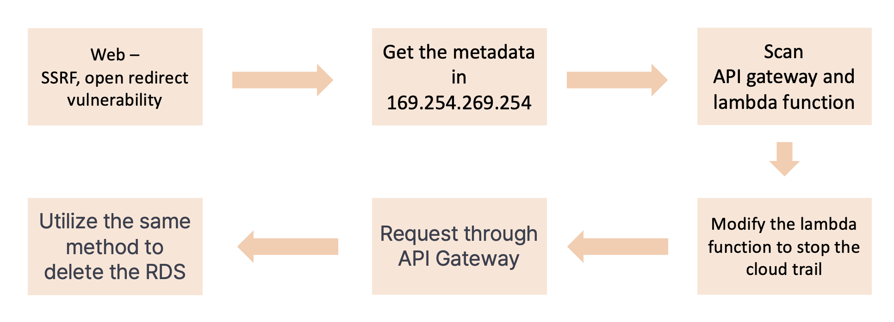

# Scenario: SSRF-APIGW (SSRF - APIGateway)

**Size:** Medium

**Difficulty:** Moderate

**Command:** 
- creation: `$ cd ./terraform; terraform init; terraform apply`
- destruction: `$ cd ./terraform; terraform destroy`

## Scenario Resources

- EC2 x 1
- Lambda x 1
- API Gateway x 1
- RDS x 1 

## Start of Scenario

- Public IP Address of an EC2 server which runs a web application
- http://printed IP/login.php:80

## Scenario Goal(s)

Stop the cloud trail and delete the RDS (cr-ssrf-rds). 

## Summary

Exploiting SSRF and open redirect vulnerabilities, you can retrieve metadata. Modify a Lambda function to halt CloudTrail and send requests through API Gateway. Utilize the same method to delete an RDS instance
## Exploitation Route(s)

